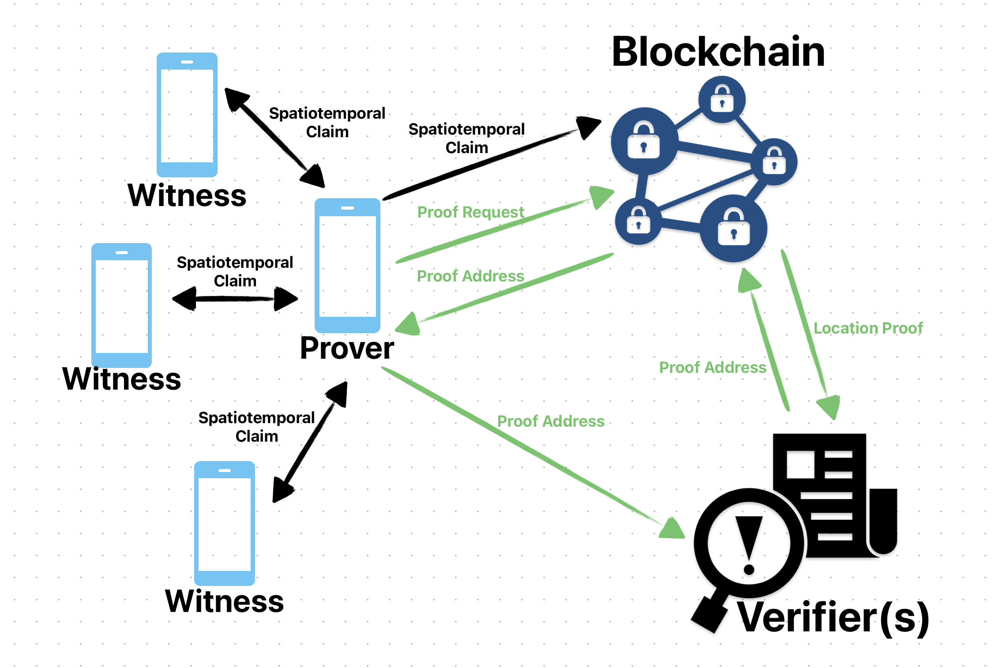
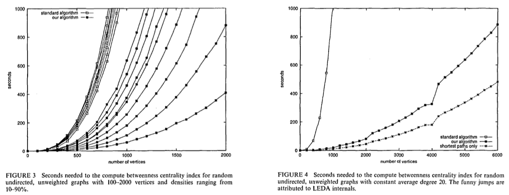
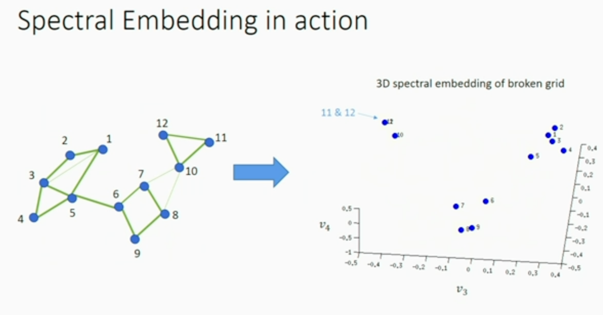

### Blockchain-Based Proof of Location with Outlier Detection

> Paper Version: CSCD92 Deliverable (2023 Apr 20)
>
> Below is the final archive for the CSCD92 course, led by Professor Thierry Sans. The goal of this document is to develop into a research paper that can be submitted to a conference.

We offer a decentralized and infrastructure-independent proof-of-location architecture, which consists of 

- Prover, 
- Witness, 
- Oracle (Privacy-Preserving Blockchain), and 
- Verifier components. 

The peer-to-peer connections utilize short-range communication technologies like Bluetooth, while network connections are employed when communicating with the Oracle.

> **We are not using Infrasture-dependent:**
> Existing PoL solutions tend to use infrastructure dependent because they can cover a large area in the early stage. but at the same time, it will introduce multiple parties to this space, consider that all the participants are selfish [19_Collusion_in_P2P_systems], this could blocking the popularization of the network, therefore, the problem has been reduced to incentivizing different party so they can keep participating and contribute.
>
> Here is how existing solutions attempts to slove this problem:
>
> 1. Introduce One party  [7_HeliumWP]:
>
>    One simple example is Helium, which only introduced one partiy called "coverage provider", "Powering the Helium network is a blockchain with a native protocol token incentivizing a twosided marketplace between coverage providers and coverage consumers."
>
>    Note: Helium is an infrasture-dependent decentrorlized network protocal, to become a "coverage provider", they are required to purchase a specialized Helium device running wireless network protocol.
>
> 2. Introduce multiple party [4_FOAM_Whitepaper]:
>
>    Add a stage to prepare for the popularization of PoL network.
>
>    The early stage did not have the PoL function, and mainly focused on preparing for the crowdsourced map using tools like Token Curated Registries(TCR) which cummulate the Point of Interest(POI) to the registry,  and help the progress to usable PoL function.
>
>    Note: They are still at crowdsource map stage.

### Protocol

> **Proactive Location Proof** [5_ProvingYourLocationWithoutGivingupYourPrivacy(Cited87)] :
>
> "A proactive location proof is a location proof that is collected by a user for future purposes, without having a target application in mind."
>
> - Proactive Location Proof also sloves the design goal: Application-Agnostic Location Proofs (location proofs should be produces in an application-agnosic manner, to reduce the workload and battery power consumption.)
>
> The paper claim that in most scenarios, users have an incentive to collect location proofs continuously, in particular, before using an application and maybe even before knowing about the application.
>
> One difference between our Proactive Location Proof and this paper is that our users are continuously uploading Spatiotemporal Claim instead of generating Location Proof, a Location Proof only be generated when user requests it.

#### Part 1(Before Oracle) Peer to Peer:

##### Join the network (Pseudonym):

In traditional methods, when a new node joins the network, they need to register a constant number of pseudonyms with a certificate authority, and the list of pseudonyms becomes permanent. This means that if a pseudonym related to your real identity is exposed, your privacy is permanently decreased when using the network. 

However, in our case, since we use blockchain technology to generate the proofs, new nodes don't need to register with a Certificate Authority. As a result, a real identity can add any number of pseudonyms anytime.

This makes better **source location unobservability** and **pseudonym unlinkability** possible, as defined in [13_APPLAUS].

This also prevents Bluetooth address attacks, which other papers have not mentioned. This type of attack leverages the fact that each node has a Bluetooth address that can be leaked to nearby peers. In traditional methods, if two peers do not leave each other's range for an extended period (e.g., waiting until the update or witness scheduling cycle finishes), they can collect all the pseudonyms from each other by identifying the same Bluetooth address. As a result, the pseudonym unlinkability for that node is compromised, and if the linked pseudonyms are made public, source location unobservability is also invalidated.

Since our approach allows for an unlimited number of pseudonyms instead of using a CA to create a fixed number of pseudonyms, a node can increase the number of pseudonyms if they feel unsafe, which provides better source location unobservability and pseudonym unlinkability(Consider the Bluetooth address is not uploaded to the chain).

[Example periodically changing Pseudonym, source location unobservability and pseudonym unlinkability]

##### Spatiotemporal Claim(SC) Request:

[user-centric location privacy model: update scheduling and witness scheduling]

The Prover periodically generates Spatiotemporal Claim request and sends them to nearby witnesses:

Our 3 way communication (instead of classic 4 way for infrastructure dependent approach):

> Define Server = Oracle here

1. Prover broadcast Spatiotemporal Claim request with following datas to witness:
   - Request = {Pseu~prov~ | Nonce~prov~ | Range | Location | Time}

2. When Witness receives the request and send the SC to the prover:
   - M = Request | time | Range | Location
   - Proof = E~serv~{ Pseu~Witt~ | M | S~Witness~(M)}

3. The Prover forward SC(s) to Server

   > A SC contains all the necessary time information, including the time when the request was created and when the witness signed the SC. Additionally, the server takes the timestamp into account when receiving the SC. This prevents replay attacks or a Prover from holding onto a signed SC for an extended period in order to "store" their location for future use.

   - Server will store the location based on the location the witness guessed, the more the number of Proof, the more credible and accurate the location.
     - Short range bluetooth: inside 10m
     - Longer rang bluetooth: 100m, newer technologies like Bluetooth 5.1 introduce a feature called Angle of Arrival (AoA) and Angle of Departure (AoD). These features enable Bluetooth devices with specialized antennas and firmware to estimate the direction of another device

##### Generation of Location Proof:

A Location Proof is a document that allows the prover to prove their location at a specific time to verifiers. Compared to traditional Location Proof, our approach supports features that protect the prover's privacy, customizable availability/expiration times, granularity (not limited to a hardcoded integer number of levels, as in traditional methods) and target verifier address.

1. Prover need create the Location Proof by sending following to Server
   - M = time | LP_time_window | LP_granularity | verifier_Address
   - LP~req~ = E~serv~{ M | S~prov~(M) }
2. After server received the LP~req~ it will run though the Part2 then return one of the following:
   - LP_address
3. The prover will forward this LP_address to verifier

##### Verification of Location Proof: 

A verifier with a verifier_Address can access the LP_address through the Privacy-Preserving Blockchain during the LP_time_window and view the prover's LP_granularity location at the time set by the prover.

There are some variables related to this location proof, which are shown to the verifier and not controlled by the prover. For example, the credibility of the location can be represented by the size of the cluster on the proof-correlation graph at a given time, or the average time delay or total weight of the proof. These variables provide additional information about the location proof, enhancing its trustworthiness and reliability.

#### Part 2(Behind Oracle) Use the Privaty Perserving Blockchain to compute:

##### Privacy (Existing Approchs)

- Normal LBS: Users upload their GPS location to a centralized server, but this approach cannot prevent hacks like those in Pokémon Go.

- Traditional PoL: Relies on centralized verifiers and Certificate Authorities (CAs).

  - It's beneficial because the knowledge of privacy information is separately distributed among the location proof server, the CA (Certificate Authority), and the verifier. As a result, each party only has partial knowledge, making it acceptable for the server to be untrusted.

    However, a chain is only as strong as its weakest link, and the centralized verifier and CA can be considered its weakest links. 

    Depending on the implementation, an untrusted verifier could potentially query everyone's location if they obtain a list of users' real identities. (very easy if its just student numbers). Additionally, everything depends on the CA, including the registration of verifiers. This dependency makes the system less scalable and flexible. 

    Centralized systems like these may face challenges in terms of adaptability and accommodating large-scale growth.

- Existing Blockchain-based Proof of Location (infrastructure-dependent = with AP)

  - [5_ProvingYourLocationWithoutGivingupYourPrivacy(Cited87)]

  - > "The user should be given the ability to control how much location information to disclose in response to the location requirements of different applications and services...For proactive location proofs, this is not possible since the user does not yet know about the granularity required by an application."
    >
    > Solution: 
    >
    > - issuer encrypts the five granularity representations of the location with five different symmetric keys, and includes the five ciphertexts in the location proof.
    > - When the user finally wants to present the proof to an application, he reveals the appropriate key to the application, which can decrypt location information of a specific granularity level, as required by the application.

  - > "Even if a proof contains only coarse-grained location information, it might still be possible to learn a user’s fine-grained location simply by looking up the location of the AP issuing the proof on the Internet."
    >
    > Solution: 
    >
    > - Group Signature Schemes: A proof issued by any member of the group will be verifiable by the application, but the application has no way of knowing which issuer created the proof.
    > - Note: Group manager can learn the signer’s identity

  - Those problem doesnt apply to our scheme because the granularity is a part of Location Proof request, and Location Proof doenst contains information about which "issuer" are creating the proof.

- Existing Blockchain-based Proof of Location: Addresses some issues but still has privacy concerns related to user identity. [2_Blockchain-Based Proof of Location]

  > The following is a concise summary comparing the Connectivity-based and Clustering-based approaches from the "Outlier Detection Methods" section.

  - The current implementation of existing blockchain-based proof of location systems uses Betweenness Ranking for outlier detection on the blockchain (as mentioned in a 2018 paper [2_Blockchain-Based Proof of Location]). The issue with this approach is that it only considers two location proofs to be correlated if they occurred at the same time (e.g., within 60 seconds). The betweenness ranking is not feasible on a typical blockchain with latency, and even on a centralized server, this method doesn't consider the graph before and after the required time to make more precise decisions. That's why we will use the Correlation Clustering method, which addresses these limitations and provides more accurate results.

    > Other issue 1:
    > the scheme depends on "short-range communication technology", the paper didn't mention what happends if some bluetooth device have longer range.from my research, the range of bluetooth(class2, class1) can reach 10~100 meters, with external antennas, the range can be increased but cannot exceed the range defined by the class of the device.
    >
    > But if we increase the receiver's bluetooth sensitivity and increase maximum output power (by using higher gain antenna and power amplifier), its possible to increase two honest trusted node to connect to each other.
    >
    > This will encourage miners to increase the range of each node to get higher pay, and since the scheme is no longer "short-range" the "lying tolerance" will increased to length of farest node they can reach.
    >
    > Other issue 2:
    > When they talk about "letting the blockchain compute", there is a suspicion that all peers should calculate the betweenness ranking (mobile phone mining will consume a lot of resources and not feasible).

##### Noteworthy Summary (Future Study)

It should be noted here that the verification methods behind PoW and P2P are different. Traditional PoW can "letting the blockchain compute" because all verifiers only need to consume constant time to verify the result, and all blockchains can use the mining pool to reduce repeated calculations and improve sloving problematic efficiency.
But P2P cannot do this, because the paper does not provide a method similar to verifying the hash value to confidently verify the Spatiotemporal Claim between two nodes.

I think there is only one possibility to make this issue reasonable (but this part is not mentioned in the paper), that is to find a mathematical way to let other nodes confidently verify the betweenness result under logtime calculated by a certain node. (In other words, a real parallel calculation support efficient self-proof)

Future studies should aim to either prove that this problem is unsolvable or demonstrate that its level of difficulty is at least as challenging as proving the Halting problem.

##### Privaty Perserving Blockchain-based Proof of Location:

As mentioned in "Verification of Location Proof," a Location Proof may contain optional variables. These optional variables are derived from the method that generates the proof based on the existing present claims.

There is no absolute right or wrong answer for a proof because 

- honest nodes may sometimes lack sufficient information on the server, resulting in a proof that is not 100% certain. 
- The protocol doesnt pervent 50% attack in local level.

Consequently, servers need methods to calculate values representing the certainty and present them to the verifier.

The trade-offs between calculation time and space depend on the specific requirements of the application using the protocol, which distinguishes the different methods.

Please note that this chapter serves as an extension, as the problem being discussed extends beyond the protocol itself and there is no one-size-fits-all solution at this point.

##### Colliding Attacks:

Collusion is broadly defined as any malicious coordinated behavior of a group of users aimed at gaining undeserved benefits, or at damaging (some) well behaved users.

In the problem of decentralized PoL, we define the certainty of a location proof as the likelihood that the proof is true or unaffected by attacks, mainly colluding attacks.

##### Why colliding attacks:

- "The methods devised to attract the contribution of users are unfortunately vulnerable to a particular class of attacks: collusion." [19_Collusion_in_P2P_systems]

- An alternative definition that drives the importance of Colliding attacks:

  - "blockchain oracle is not the data source itself, but rather the layer that queries, verifies, and authenticates external data sources and then relays that information."  [0_A Study of Blockchain Oracles]

  - What we are building fits to the definition as an oracle with protocol that uses a traditional Oracle structure while supporting PoL which current Oracles don't support.

  - Therefore our approch of PoL also inhertes "Oracle Problem" [1_Understanding the Blockchain Oracle Problem A Call for Action], The Oracle problem arises when trying to ensure that the external data used by a smart contract is accurate and tamper-proof. Since the data is not stored on the blockchain, it is not protected by the blockchain's security features. As a result, a malicious actor could potentially manipulate the external data used *by a smart contract*, causing it to execute incorrectly.
  - The communication between the prover and witness occurs locally, making it unprotected by the blockchain, as there is no efficient way to verify these interactions. Consequently, this part is primarily susceptible to attacks due to its oracle problem nature. When considering the verification process between the prover and server, the data must be correctly signed, which makes colliding attacks the primary concern.

## Outlier Detection Methods:

> Outlier detection methods in a P2P (peer-to-peer) network for preventing colluding attacks.
>
> The calculations for the following methods can be performed either by the verifier or on-chain, depending on the requirement of the application.

#### Approach1: Connectivity-based:

##### Betweenness centrality (Betweenness ranking):

- Definition: a way of detecting the amount of influence a node has over the flow of information in a graph.
- Definition: a measure used in network analysis to identify the importance of individual nodes (or vertices) within a network.
- Meaning: Nodes with high betweenness centrality have a higher likelihood of occurring on a large number of shortest paths, indicating their significance in maintaining the overall connectivity of the network.

- Calculation: take every pair of the network and count how many times a node can interrupt the shortest paths (geodesic distance) between the two nodes of the pair.
  - Note: The geodesic distance depends on the **shortest path** over existing edges, while the Euclidean distance depends on the **straight-line** distance.

##### Why it's important:

- [20_Attack Robustness and Centrality of Complex Networks] In a study examining how different removal strategies impact network robustness, the results show that among all networks (including assortative, model, or empirical networks), decreasing the order of their betweenness centrality affects network robustness the most, compared to degree, closeness, and eigenvector centrality under sequential or simultaneous targeted attacks. This suggests that betweenness centrality is the most effective way to identify the importance of individual nodes in a network.

- Calculating betweenness doesn't directly provide us with the certainty of a location proof. However, a node with lower betweenness implies that it has less influence on the network, meaning that it would require less effort to fake. [13_APPLAUS] "Individuals with the lowest betweenness usually only connect to one or few neighbors. They are treated as outliers among all the nodes and thus most likely are colluding attackers". 

- This subsection will outline the steps for using betweenness certainty as location proof certainty, which the verifier can utilize to make decisions. It is important to note that other methods for calculating location proof certainty may exist, but they could take more time to compute. For example, some verifiers or applications may be willing to consider other related centrality measures such as degree, closeness, and eigenvector centrality. 

  > However, the algorithms for calculating these measures and their worst-case running times are beyond the scope of this paper.

**Convert Ranking to %**:

If we aim to define Location Proof Centrality (as a percentage) based solely on the Betweenness Centrality that Percent Claim possesses, this would result in a definition of Location Proof that is equivalent to the amount of influence a SC has over the flow of information in a graph within the context of betweenness. This calculation, however, does not yield or reveal any new information, as it is merely a conversion that changes the representation of betweenness from a value to a percentage. Nevertheless, we will provide some examples to demonstrate the conversion process, and this could be extended to summarize the Location Proof Centrality (as a percentage) based on more available data.

- In [13_APPLAUS], the conversion or normalization is defined by dividing the maximum possible number of shortest paths that could pass through any node in the network (B(v) = $\sum_{s\neq v \neq t} \frac{\sigma_{st}(v)}{\sigma_{st}}$). The efficiency of this normalization depends on the network's size and structure. As a result, the complexity of calcuate this denominator will be O(n^3) if we are using the Floyd-Warshall algorithm, and the problem appears to be intractable within logarithmic time.

- In [17_Outlier Detection in Network Data using the Betweenness centrality], outliers are identified based on the p-value method, which requires statistical tests such as the t-test, chi-squared test, or hypothesis testing. The result is a percentage representing the confidence of a node being an outlier; hence, we can obtain the Location Proof Centrality by subtracting this percentage from 1.

**Computationally Expensive**:

- Calculating the betweenness centrality for unweighted graphs requires O(mn^3) due to the complexity of the algorithm and the necessity to evaluate the paths and flow of information between nodes.

- Using breadth-first search allows for a more efficient O(mn) time complexity and O(n^2) space complexity, streamlining the process and reducing resource requirements.

- [17_Outlier Detection in Network Data using the Betweenness centrality] states that the p-value method requires O(n^2) time and O(n^2) space for comparing each data point with others, highlighting that this is the computation cost to execute the p-value method while determining betweenness centrality.

- [13_APPLAUS] introduced two improvements:

  - Improvement 1: The closer vertices can be computed based on the dependencies of the farther vertices. Combined with approach from [15_A faster algorithm for betweenness centrality], this results in O(mn) time complexity and O(n+m) space complexity, which is still relatively slow.

    Result from [15_A faster algorithm for betweenness centrality]:

    

  - Improvement 2: To account for all concurrent location proofs **within a 60-second delay** in a **specific region**, The development of an efficient algorithm to compute betweenness centrality remains an unsolved problem. This issue is still considered computationally expensive for practical use, particularly in blockchain applications.

- Other Trade-Offs (Better than Improvement 2):

  > Instead of setting hardcoded ranges for temporal and spatial regions, there are better approaches to make the algorithm run in logarithmic time while the result reflects more accurate betweenness values across the entire network.
  >
  > Take note of the following methods that create a betweenness ranking for the entire network at any time (granularity may depend on the initial request). Once calculated, these ranking can be resued/shared for different location queries.
  >
  > This is somewhat similar to B2B. Depending on the user's purpose, 
  >
  > - they could use approximation, which fast and will improves over time. 
  >
  > - Alternatively, they could calculate the requested region and then, when not busy, connect all regions.

  - Using heuristics: In some cases, it might be possible to apply heuristics or domain-specific knowledge to reduce the search space and focus on the most important nodes, One example involves using heuristics to determine the time delay and region radius in Improvement 2.
  - Approximation algorithms: Instead of calculating betweenness centrality for all pairs of nodes, approximation algorithms compute the betweenness centrality using a random sample of node pairs or a fixed number of randomly chosen nodes as sources. This reduces the computational complexity and can provide reasonably accurate estimates of betweenness centrality in many cases. One popular approximation algorithm is the Brandes' algorithm, which has a time complexity of O(nm), where n is the number of nodes and m is the number of edges.
  - Parallel and distributed computing: Another way to address the efficiency issue is by leveraging parallel and distributed computing resources. By dividing the task of computing betweenness centrality among multiple nodes, the overall computation time can be significantly reduced, the current challenge is to find a method that allows different nodes to collaborate effectively without duplicating the calculations needed to construct the betweenness ranking.

#### Approach2: Clustering-based (Correlation clustering):

Clustering-based approaches involve grouping data points with similar characteristics into clusters, while treating those points that do not fit into any cluster as outliers. These approaches often involve optimizing an objective function to determine the optimal number of clusters or the cluster centroids. Solving the clustering problem optimally is known to be NP-hard, which means that approximation algorithms are generally employed to find near-optimal solutions efficiently.

Compared to connectivity-based approaches like betweenness centrality, the approximations obtained through clustering-based methods might be more meaningful due to their focus on the inherent structure of the data. While betweenness centrality measures the influence of a node within a network based on the flow of information, clustering-based approaches capture the similarity of data points, making them more applicable to a wider range of problems.

- Spectral clustering: This method utilizes the spectrum (eigenvalues) of the similarity matrix of the dataset to perform dimensionality reduction before clustering the data points in a lower-dimensional space. One example of spectral clustering is a 3D spectral embedding, where the XY plane represents the Spatiotemporal Claim location, and the Z axis represents time. The benefits of this type of clustering include embedding all the information within a unified space, making it easier to visualize and analyze the relationships between data points. Every node should have a continuous path during continuous time, reflecting the temporal aspect of the data.

  When calculating the clustering data, we can also apply techniques from Paper08 to help detect outliers. By incorporating [8_CLIP_Continuous_Location_Integrity_and_Provenance_for_Mobile_Phones], the spectral clustering approach can better identify anomalous patterns or data points within the 3D space that do not fit well with the rest of the dataset. This combination of clustering and outlier detection methods allows for a more comprehensive analysis of the data, taking into account both spatial and temporal dimensions.

  Example of Spectral Embedding (https://youtu.be/-Afa1WI3iug): 

  

- Message-passing algorithms: Soso need more data

- Linear programming: As seen in [16_Correlation clustering in general weighted graphs], linear programming can be employed to formulate and solve optimization problems related to clustering or outlier detection by minimizing or maximizing a linear objective function subject to linear constraints. We will focus on the combination of linear programming and correlation clustering mentioned below.

Next Step

##### Part1: Use combination of first part of Correlation Clustering (Linear programming show exists)

##### Part2: Use Graph Clustering Algorithms: K-means with 3d Spectral Embedding + 4-means

> Using 
>
> - Louvain method
> - DBSCAN
> - k-means (Loyd's Algorithm) https://youtu.be/-Afa1WI3iug
>   - Using k-means++ then repeat update C

> Consider [13_APPLAUS] is more Theory side, but we are Practice
>
> Theory: want to prove general guarantees, require optimizing a fixed objective
>
> Pratice: want a good clustering. Mixtrue of theory & tweaking (pre and post processing)
>
> ---Tselil Schramm (Simons Institute, UC Berkeley)

Find optial set of centers is NP-hard, and this is not the problem that can be approximate abituraly well.

#### TODO:

1. Finish Red Text mentiond above, Elaborate on Future works mentiond above by reading more paper
2. Performance Evaluation
3. futurework talk about can support **reputation system vs  gratification/punishment system vs Incentive systems**: types and vulnerabilities
4. Paragraph about exists a instance of Privaty Perserving Blockchain: Secret Network
5. Parallel and distributed computing (iphone has same tech as Sercert Network: Secure Enclave) https://support.apple.com/en-ca/guide/security/sec59b0b31ff/web
6. add a section talking about all kind of attacks
7. mention & add reference too all 20 papers I read across this paper
8. learned Pseudonym from bluetooth address locally: 
   - Current method: add more on how unlimited Pseudonym works (how to schedule or reach a consensus with the server)
   - Option2: try authenticator app?
9. Elaborate more on [20_Attack Robustness and Centrality of Complex Networks]
   - "Empirical networks": This paper introduces different types of networks (graphs), including  which my interest lies in. 
   - This paper emphasizes the significant differences that structural differences between model and empirical networks can cause, which is worth noting.

#### REFERENCES:

[0] A. Beniiche, “A study of Blockchain Oracles,” *arXiv.org*, 14-Jul-2020. [Online]. Available: https://arxiv.org/abs/2004.07140. [Accessed: 17-Jan-2023]. 

[1] G. Caldarelli, “Understanding the blockchain oracle problem: A call for action,” *MDPI*, 29-Oct-2020. [Online]. Available: https://www.mdpi.com/2078-2489/11/11/509. [Accessed: 19-Jan-2023]. 

[2] M. Amoretti, G. Brambilla, F. Medioli and F. Zanichelli, "Blockchain-Based Proof of Location," 2018 IEEE International Conference on Software Quality, Reliability and Security Companion (QRS-C), Lisbon, Portugal, 2018, pp. 146-153, doi: 10.1109/QRS-C.2018.00038. [Accessed: 20-Jan-2023].

[4] FOAM Whitepaper: http://s3.amazonaws.com/arena-attachments/2133526/1087ac03b556ea8a5f104f5522c6bb3f.pdf

[5] W. Luo and U. Hengartner, “Proving your location without giving up your privacy: Proceedings of the eleventh workshop on Mobile Computing Systems & Applications,” *ACM Conferences*, 01-Feb-2010. [Online]. Available: https://dl.acm.org/doi/abs/10.1145/1734583.1734586?casa_token=aaWMQcYjymYAAAAA%3AmDIjktPCref5yzQUKNd-XQcO9DpNN3K1h4gSpDtZuYfYK5nQ1POmJZY26N_RbGJds3Bns83ARyIe5c8. [Accessed: 23-Feb-2023].

[7] A. Haleem, A. Allen, A. Thompson, M. Nijdam, and R. Garg, *Helium: A Decentralized Wireless Network*, 14-Nov-2018. [Online]. Available: http://whitepaper.helium.com/. [Accessed: 17-Feb-2023]. 

[8] C. Lyu, A. Pande, X. Wang, J. Zhu, D. Gu and P. Mohapatra, "CLIP: Continuous Location Integrity and Provenance for Mobile Phones," 2015 IEEE 12th International Conference on Mobile Ad Hoc and Sensor Systems, Dallas, TX, USA, 2015, pp. 172-180, doi: 10.1109/MASS.2015.33. [Accessed: 09-Mar-2023].

[13] Z. Zhu and G. Cao, "Toward Privacy Preserving and Collusion Resistance in a Location Proof Updating System," in IEEE Transactions on Mobile Computing, vol. 12, no. 1, pp. 51-64, Jan. 2013, doi: 10.1109/TMC.2011.237. [Accessed: 11-Apr-2023]. 

[15] U. Brandes, “A faster algorithm for betweenness centrality,” *Taylor & Francis*, 2001. [Online]. Available: https://www.tandfonline.com/doi/abs/10.1080/0022250x.2001.9990249?casa_token=HFGThPaZ5yMAAAAA%3AHMHTy7y8JLsQ-qjvGZERxkG4gtAm6HCTb-NSiE5h3o2PLUjgpSkiTirzQj1k34XJGl-U4TRmC7JnTeE. [Accessed: 29-Mar-2023]. 

[16] E. D. Demaine, D. Emanuel, A. Fiat, and N. Immorlica, “Correlation clustering in general weighted graphs,” *Theoretical Computer Science*, 15-Jun-2006. [Online]. Available: https://www.sciencedirect.com/science/article/pii/S0304397506003227. [Accessed: 29-Mar-2023]. 

[17] H. B. Mihiri Shashikala, R. George and K. A. Shujaee, "Outlier detection in network data using the Betweenness Centrality," SoutheastCon 2015, Fort Lauderdale, FL, USA, 2015, pp. 1-5, doi: 10.1109/SECON.2015.7133008. [Accessed: 7-Apr-2023]. 

[19] G. Ciccarelli and R. L.  Cigno, “Collusion in peer-to-peer systems,” *Computer Networks*, 23-Jul-2011. [Online]. Available: https://www.sciencedirect.com/science/article/pii/S1389128611002581?casa_token=q-VJo7EGXTYAAAAA%3AgwnfyIfCnr-R2f9xFCbQ4tMaF17PeA8iD6K_WKiYBWwZObfHo8CFwrUVBVDilzVg_TxrrGkwWuR2. [Accessed: 12-Apr-2023]. 

[20] S. Iyer, T. Killingback, B. Sundaram, and Z. Wang, “Attack robustness and centrality of complex networks,” *PLOS ONE*, Apr-2013. [Online]. Available: https://journals.plos.org/plosone/article?id=10.1371%2Fjournal.pone.0059613. [Accessed: 10-Apr-2023]. 

#### Future Reading:

[6 didnt use] “Location Services Privacy Overview - Apple.” [Online]. Available: https://www.apple.com/privacy/docs/Location_Services_White_Paper_Nov_2019.pdf. [Accessed: 02-Feb-2023]. 

[9 didnt use] G. Wang, B. Wang, T. Wang, A. Nika, H. Zheng and B. Y. Zhao, "Ghost Riders: Sybil Attacks on Crowdsourced Mobile Mapping Services," in IEEE/ACM Transactions on Networking, vol. 26, no. 3, pp. 1123-1136, June 2018, doi: 10.1109/TNET.2018.2818073. [Accessed: 23-Feb-2023].

[11 didnt use] Y. Merrad, M. H. Habaebi, M. R. Islam, T. S. Gunawan, and M. Mesri, “Robust decentralized proof of location for blockchain energy applications using game theory and random selection,” *MDPI*, 18-May-2022. [Online]. Available: https://www.mdpi.com/2071-1050/14/10/6123. [Accessed: 24-Feb-2023]. 

[12 didnt use] “PBIM: A participant based incentive mechanism for ... - researchgate.” [Online]. Available: https://www.researchgate.net/publication/360832095_PBIM_A_Participant_Based_Incentive_Mechanism_for_Consortium_Chain. [Accessed: 23-Feb-2023]. 

[18 didnt use] W. Wu, E. Liu, X. Gong and R. Wang, "Blockchain Based Zero-Knowledge Proof of Location in IoT," ICC 2020 - 2020 IEEE International Conference on Communications (ICC), Dublin, Ireland, 2020, pp. 1-7, doi: 10.1109/ICC40277.2020.9149366. [Accessed: 7-Apr-2023]. 
